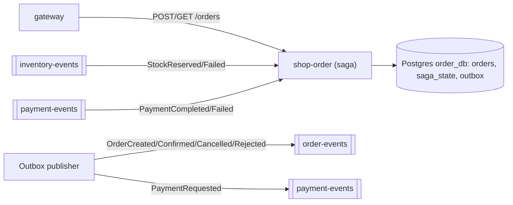
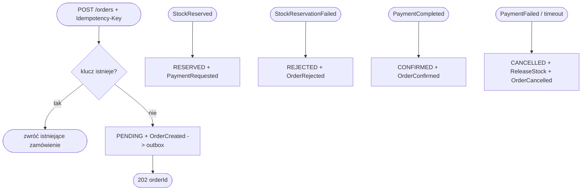

# shop-order

Orkiestrator sagi — dyryguje całą rozproszoną transakcją zakupu, w tym
kompensacją przy niepowodzeniu. Standalone repo z własnym `Dockerfile` i kodem.
Stack: Spring Boot + JPA (Postgres) + Spring Kafka.

## Maszyna stanów zamówienia

```
PENDING ──StockReserved──> RESERVED ──PaymentCompleted──> CONFIRMED
   │                          │
   │ StockReservationFailed   │ PaymentFailed
   ▼                          ▼
REJECTED                   CANCELLED  (+ emisja ReleaseStock)
```

Stan i krok sagi zapisywane w bazie (`saga_state`), by po restarcie wznowić.

## API do zaimplementowania

| Metoda | Ścieżka        | Uwagi                                       |
|--------|----------------|---------------------------------------------|
| POST   | `/orders`      | nagłówek `Idempotency-Key` wymagany         |
| GET    | `/orders/{id}` | status (shop-ui odpytuje / SSE)             |

`Idempotency-Key` jako `UNIQUE` w `orders` — ponowione żądanie zwraca istniejące
zamówienie zamiast tworzyć duplikat.

## Zdarzenia Kafki

Publikuje (`order-events` klucz `orderId`; `payment-events` dla żądania płatności):
`OrderCreated`, `PaymentRequested`, `ReleaseStock`, `OrderConfirmed`,
`OrderCancelled`, `OrderRejected`.

Konsumuje (grupa `shop-order`): `StockReserved`, `StockReservationFailed`
(z `inventory-events`), `PaymentCompleted`, `PaymentFailed` (z `payment-events`).

## Przepływ orkiestracji (do zaimplementowania)

1. `POST /orders` → utwórz `PENDING`, zapisz `OrderCreated` do `outbox`.
2. `StockReserved` → `RESERVED`, wyemituj `PaymentRequested`.
   `StockReservationFailed` → `REJECTED` (forward recovery, **bez** kompensacji).
3. `PaymentCompleted` → `CONFIRMED`, wyemituj `OrderConfirmed`.
   `PaymentFailed` → `CANCELLED`, wyemituj `ReleaseStock` (kompensacja) **oraz**
   `OrderCancelled`.

## Timeout sagi
`SAGA_PAYMENT_TIMEOUT_SECONDS` — brak wyniku płatności w czasie uruchamia
kompensację (zwolnij stock, anuluj). Realizacja przez zadanie skanujące utknięte sagi.

## Outbox + idempotencja
Wszystkie zdarzenia przez `outbox`; konsumenci chronieni `processed_events`.

## Skalowanie
Bezstanowy (stan sagi w bazie) → wiele instancji; partycje po `orderId` zapewniają
kolejność zdarzeń jednego zamówienia.

## Konfiguracja (env)
`SPRING_DATASOURCE_URL=.../order_db`, `SPRING_KAFKA_BOOTSTRAP_SERVERS=shop-kafka:9092`,
`SPRING_KAFKA_CONSUMER_GROUP_ID=shop-order`, `SAGA_PAYMENT_TIMEOUT_SECONDS=30`.

## High Level Design (ogólny workflow)

Orkiestrator sagi: REST (`POST/GET /orders`) tworzy zamówienie i wystawia zdarzenia
przez outbox; konsumuje wyniki z `inventory-events` i `payment-events` i przesuwa
maszynę stanów, w razie porażki emitując kompensację (`ReleaseStock`).



## Low Level Design (diagram aktywności)

Tworzenie zamówienia i przejścia sterowane zdarzeniami:


